# Game Design for EIVBoS

## Concept
A 2D party turn-based board game with a turn based battle system.

The "overworld" is intended to be reminiscent of some of the older Mario Party game boards.

The game is intended to focus on passive player engagement between turns as well.
This type of passive engagement is taking inspiration from games such as the Jackbox games series and Paper Mario: The Thousand Year Door.

### Intended Audience
Intended to appeal to small groups of people.
The game is not intended to be played alone.
The character design is meant to poke fun at most traditional RPGs.

## Game Loop

### High Level Overview

#### Overworld State Machine
The overworld portion of the game is not very complex to describe. This is a simple state machine.

#### Battle (Out of Date, Do Not Use)

### Core Mechanics
The core mechanics are:

* Move on board
* Change player attributes
* Fight opponent (NPC or opposing player)
* Fight audience

#### Modelling Core and Supporting Mechanics with Differential Equations

## Organization

### File Structure
The file structure is primarily organized by different "screens".
Some example folders that could be in the top level of the project include "overworld", "title", "battle", "settings"

Under the top level folders, the there are subfolders to split additional components.
For example, this could include "levels", "player", and "enemies".

Splits should not traverse more than 4 directories below the scene.

Splits by file type are acceptable as a final split for an entity or level.

#### Version Control
Git will be used for version control.
Commits should reflect incremental changes. *Commit often to allow easy rollback of changes.*
Branches should be made for potentially breaking feature changes.

### Scene Tree Organization
Level scenes should be seperated to into different visual layers so that it is easier to isolate and work on different sections.
For example, UI, background, foreground.
For more simple scenes or components, it is okay for a flat scene tree to exist.

### Signals
Signals are for children to communicate to parents.
Signals will communicate to the immediate parent, but are not relayed to "grandparent" nodes.
For signals that need to travel outside the "immediate family" (parent, sibling), an event bus is used.
If a single event bus becomes too complex, there can be categories of event buses used.
No policy on usage of groups for signals at this time.

Strategy Pattern - Find more info
